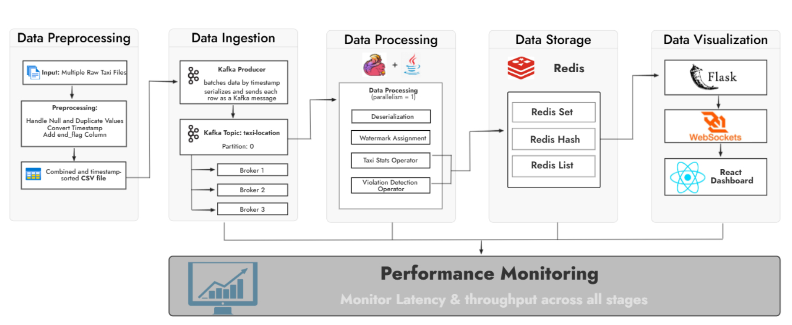
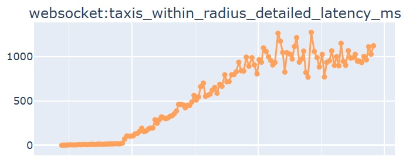
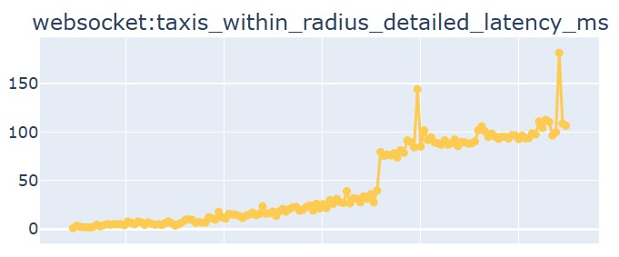
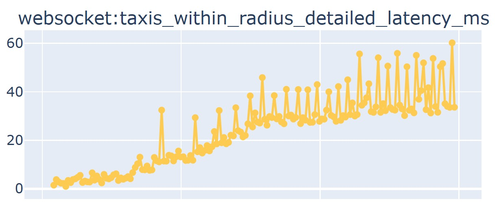

# 🚖 BD25_Project_F10_B: Real-Time Taxi Monitoring System

## 📑 Table of Contents
- [📝 Project Description](#-project-description)
- [✨ Features](#-features)
- [🧰 Tech Stack](#-tech-stack)
- [🧱 Architecture Diagram](#-architecture-diagram)
- [🚀 Getting Started](#-getting-started)
- [🛠️ Usage](#-usage)
- [🗂️ Project Structure](#-project-structure)
- [👩‍💻 Authors](#-authors)

---

## 📝 Project Description

This project is a Real-Time Taxi Monitoring System designed to visualize and analyze the movement of **10,292 taxis** operating in the city of **Beijing**. The goal is to convert raw location data into insightful, value-added information using a real-time stream processing pipeline.

The system leverages modern Big Data technologies including **Apache Kafka**, **Apache Flink**, and **Redis**, and features a dashboard interface for live visualization and alerting.

### Key Objectives:
- Replay and stream historical taxi trajectory data using Kafka, simulating real-time location updates.
- Process streamed data with Flink to calculate:
  - Instantaneous and average speeds (using the Haversine formula).
  - Total distance traveled per taxi.
  - Number of active taxis.
- Detect and notify:
  - Speed violations (above 50 km/h).
  - Geofencing violations (e.g., taxis leaving a 10 km radius around the Forbidden City).
- Store the processed statistics in Redis for fast dashboard retrieval.
- Display the data in a web-based dashboard with live updates and event alerts.

---

## ✨ Features

### 🧪 Data & Preprocessing
- **Pandas** – Data cleaning
- **Custom Scripts** – End flagging, timestamp validation

### 🔄 Real-Time Data Processing
- Simulates real-time data by preprocessing and replaying historical taxi trajectory data.
- Streams taxi data via **Apache Kafka** on topic `taxi-location`.

### 🧠 Stream Processing with Apache Flink
- Custom deserialization into `TaxiLocation` model.
- Event-time ordering using **watermarks**.
- Sequential processing via `setParallelism(1)`.

### 📍 Geospatial Analysis
- Calculates **distance from city center** using the Haversine formula.
- Classifies taxis as:
  - **Removed**: Outside 15 km → moved to Redis `removed` set.
  - **Violation**: Outside 10 km → `tenKmCrossed = true`.

### 🛣️ Movement Tracking
- Tracks:
  - Distance per taxi
  - Total fleet distance
- Updates Redis with taxi status: **Active**, **Inactive**, **Halted**, **Removed**.
- Calculates average and current speed.

### ⚠️ Violation Detection
- Detects:
  - Speed violations (> 50 km/h)
  - Area violations (> 10 km radius)
- Stores violation flags in Redis.

### 🧰 Redis State Store
- Redis stores:
  - Latest location, speed, and status
  - Total and average metrics
  - Violation flags and logs

### 🌐 Dashboard (React + Flask)
- Map with **spiderfy clustering**
- Metrics: active/inactive taxis, distance, speed, violations
- Real-time logs of status changes

---

## 🧰 Tech Stack

### 🎯 Core Technologies
- **Apache Kafka** – Real-time streaming
- **Apache Flink (Java)** – Stream processing
- **Redis** – In-memory data store

### 🐍 Backend
- **Python**
  - Kafka Producer
  - Flask (API for frontend)
  **Java**
  - Flink Consumer

### ⚛️ Frontend
- **React.js** – Dashboard interface
- **Leaflet.js** – Map rendering with clustering

### 🐳 Containerization
- **Docker & Docker Compose** – Multi-service orchestration

### ☁️ Cloud Platform
- **Azure Virtual Machines** – For hosting backend services


---

## 🧱 Architecture Diagram

The following diagram shows the data flow and interaction between components:



---

## 🚀 Getting Started on Azure Cloud

Follow these steps to set up and run the Real-Time Taxi Monitoring System on **Azure Cloud**.

### 🔧 Prerequisites
Make sure the following tools are installed:
- [Docker](https://www.docker.com/)
- [Docker Compose](https://docs.docker.com/compose/)

### 📥 Step 1: Clone the Repository
```bash
git clone https://collaborating.tuhh.de/e-19/teaching/bd25_project_f10_b.git
cd bd25_project_f10_b
```

#### ▶️ Step 2: Start All Services
```bash
docker-compose -f docker-compose.prod.yml up -d
```

This will launch:
- Apache Kafka & Zookeeper
- Apache Flink
- Kafka Producer
- Redis & Redis Insight
- Flask Backend
- React Frontend

### 🌍 Step 3: Access the Dashboard
Go to:  
🔗 [http://track-taxis.westeurope.cloudapp.azure.com:3000](http://track-taxis.westeurope.cloudapp.azure.com:3000)  
💻 (IP: [http://48.209.83.231:3000](http://48.209.83.231:3000))

### ✅ To stop:
```bash
docker-compose -f docker-compose.prod.yml down
```

## 🚀 Getting Started on Local Host

Follow these steps to set up and run the Real-Time Taxi Monitoring System locally using **Docker**.


### 📥 Step 1: Clone the Repository
```bash
git clone https://collaborating.tuhh.de/e-19/teaching/bd25_project_f10_b.git
cd bd25_project_f10_b
```

#### 🐳 Step 2: Build Docker Images
```bash
docker-compose -f docker-compose.dev.yml build
```

#### ▶️ Step 3: Start All Services
```bash
docker-compose -f docker-compose.dev.yml up -d
```

This will launch:
- Apache Kafka & Zookeeper
- Apache Flink 
- Kafka Producer
- Redis
- Flask Backend
- React Frontend

### 🌍 Step 4: Access the Dashboard
Go to: [http://localhost:3000](http://localhost:3000)

### ✅ To stop:
```bash
docker-compose -f docker-compose.dev.yml down 
```

## 🛠️ Usage

### 🚖 View the Taxi Map
- Live updates of taxi positions in Beijing
- **Spiderfy clustering** in high-density areas

### 🌐 Map Controls
- Toggle grid, borders, or show only violating taxis
- Display geofence zones (10km & 15km radius)
- Real-time visualization of traffic density (congested, moderate, free flow)

### 📊 Monitor Live Metrics 
- Active / Inactive / Removed / Halted taxis
- Total distance of all taxis
- Average speed
- Speed violation count
- Area violations count
- Currently driving taxis count

### 🩺 Monitoring System Health
You can monitor the system's health such as latency, throughput, CPU uage and more in real time using the following dashboards, all hosted on our Azure VM:

- [🚦 Backend Metrics Dashboard](http://track-taxis.westeurope.cloudapp.azure.com:5001/metrics/backend)
- [📬 Consumer Metrics Dashboard](http://track-taxis.westeurope.cloudapp.azure.com:5001/metrics/consumer)
- [🚕 Producer Metrics Dashboard](http://track-taxis.westeurope.cloudapp.azure.com:5001/metrics/producer)

### ⚠️ View Alerts & Logs
- Speed > 50 km/h
- Left the 10 km radius
- Status transitions in logs

### 🔍 Taxi Filters
- Filter taxis by status, violations etc.
- Search by Taxi ID for detailed insights

---

## 🗂️ Project Structure

```
project-root/
├── dashboard/
│    ├──app/
│    │   └── start.py
│    └──flink-dashboard-frontend/
│       ├── App.js
│       ├── index.js
│       ├──package.json
│       ├──README.md
│       ├──node_modules/
│       ├──public/
│       └──src/
│          ├── components/
│          ├──images/
│          └──style/
├── Dockerfile
├── requirements.txt  
├── flink-consumer/
│   ├── Dockerfile
│   ├── pom.xml
│   ├── wait-for-it.sh
│   └── src/main/java/org/myflinkapp/
│       ├── models/
│       ├── operators/
│       ├── service/
│       ├── utils/
│       └── Main.java
├── kafka-producer/
│   ├── producer.py
│   ├──Dockerfile
│   ├──requirements.txt
│   └──wait-for-kafka.sh
├── metrics/
│    └──metrics_logger.py
├── preprocessing/
│   └── preprocess.py
├── backend/
│   ├── routes.py
│   ├── background_tasks.py
│   └── app.py
├── redis/
├── scripts/
│   └── check_inactive_taxis.py
|   └── check_end_flag.py
|   └── check_for_unsorted_taxiIds.py
|   └── metrics_visualiser.py
|   └── Preprocess_data.py
|   └── utils.py
│   └──data_count.py
├── data/
│   ├── raw_data/
│   └── combined_taxis_data.csv
├── docs/
│   ├──  architecture_diagram.jpg/
│   ├──  architecture_diagram_v1.jpg/
│   ├── latency_after.jpg
│   ├── latency_before.jpg
│   └── latency.jpg
│   
├── docker-compose.dev.yml
├── docker-compose.prod.yml
├── requirements.txt
├── README.md
```

---

## 🚀 Optimizations

 This project involved handling and visualizing large volumes of taxi data in near real-time. To ensure responsiveness and efficiency across services, we implemented the following key optimizations:

- **Reduced Redis Latency:**  
  We observed that Redis was being hit multiple times to fetch speeding data per taxi. By optimizing the access flow to fetch data only **once per taxi**, we reduced overall latency from **~1000ms to ~100ms**.
  
  ### Before Optimization
  
  *Fig. 1 – Latency before optimization.*

  ### After Optimization
  
  *Fig. 2 – Latency after optimization.*

- **Kafka Compression & Multi-Broker Setup:**
  Enabled **Kafka compression** to reduce data size over the network and configured a **multi-broker Kafka setup** to ensure fault tolerance and improve scalability.


- **Map-Based Taxi Fetching:**  
  Developed the taxi_within_bounds API to serve only taxis visible in the current frontend map view. This greatly reduced unnecessary data fetching, transmission, and rendering on the dashboard, further reducing our latency from 100ms to 40ms.
  
  ### After Optimization
   
  *Fig. 3 – Latency after optimising taxi_within_bounds API*

## 👩‍💻 Authors

This project was developed as part of the **Big Data Lab** course at TUHH.

### 👥 Team Members

- **Sargunpreet Kaur**  
  *Contributions*:  
  1. Developed the complete **Flink consumer logic**, including `assignTimestampsAndWatermarks` for event-time processing, with custom stream operators for deserialization, violation detection, total distance, taxi-wise distance, speed, and average speed calculation.  
  2. Implemented the **Taxi Inflow Monitor** operator in Java with corresponding frontend integration.
  3. Added **logging** to the Flink console for monitoring key processing stages and debugging.
  4. Populated Redis **hashes**, **sets**, and **lists** with taxi metrics.
  5. Wrote scripts to check `'end_flag'`, detect **unsorted timestamps**, and validate taxi data. 
  6. Performed **data preprocessing**, including flagging and formatting.
  7. Implemented **map clustering** and customized it to visually highlight **speeding taxis** using red icons.
  8. Added **tracking logic** for individual taxis, represented with purple icons on the map.  
  9. Added **checkbox controls** for toggling *Show Borders*, *Taxi Inflow Monitor*, and *Speeding Taxis*.  
  10. Enabled filtering to display **only speeding taxis**, using red icons with ID and speed.
  11. Displayed **taxi ID labels** on all taxis; clicking a taxi reveals **speed and total distance**.
  12. Implemented **live logs display** on the frontend to stream real-time updates.
  13. Added a **legend** to explain icons and map features.
  14. Wrote and structured the project’s **README.md** to document setup, features, and contributions.

- **Doğa Ruken Güneş**  
  *Contributions*:
  1. Built a **Kafka producer** in Python to stream taxi data from a combined CSV file.
  2. Optimized *Kafka batching logic* for real-time simulation using identical timestamps.
  3. Embedded production **timestamps** to enable **end-to-end latency tracking**.
  4. Dockerized the **Kafka producer** and managed the full **Docker Compose setup**.
  5. Created a **wait-for-kafka.sh** script to **delay producer** launch until Kafka and Zookeeper were ready.
  6. Developed the *React dashboard* with real-time components for **taxi activity, violations, and speeding**.
  7. Dockerized the **React frontend** service for consistent local and production deployment.
  8. Implemented a **Flink metrics logger** to track **latency, throughput, CPU, and memory usage** for stream operators.
  9. Designed and presented the **mid presentation slides**.
  10. Delivered the final version of **README.md** with updated project information.

- **Doğa Bahar**  
  *Contributions*: 
  1. Developed a **Dockerized Flink Consumer**, including a custom Dockerfile and wait-for-it.sh script for coordinated service startup.
  2. Containerized the **Flask backend** and established integration with the **Redis** database for real-time data access.
  3. Initialized the **Azure Cloud environment** and provisioned a production **Virtual Machine (VM)** for deployment.
  4. Created and configured a **Docker Hub repository**; pushed locally built Docker images to the cloud.
  5. Set up secure authentication using **SSH keys** and enabled registry access for the VM.
  6. Orchestrated cloud deployment using **Docker Compose** with images pulled directly from Docker Hub Registry.
  7. Tuned the **dashboard’s CSS** for a cleaner UI and consistent styling.
  8. Designed and presented the **final project slides**, communicating the system architecture, deployment workflow, and project outcomes.

- **Shivam Suri**  
  *Contributions*: 
  1. Structured the initial project repository and established the codebase skeleton.
  2. Developed a data preprocessing script to merge input files into a single CSV and validated coordinates to ensure data points lie within or near **Beijing**.
  3. Set up and integrated a **Redis** container using **Docker**; defined consistent and readable key naming conventions.
  4. Resolved a connection issue between **Flink* and **Redis**, ensuring stable data flow.
  5. Stored per-taxi **AverageSpeed** and **TotalDistance** metrics in Redis.
  6. Fixed a logic bug in the **calculateCurrentSpeed** operator in Flink that previously produced incorrect values.
  7. Stored real-time taxi locations using the **GEOADD** command in Redis for spatial querying.
  8. Built **REST API** endpoints in the **Flask** backend to retrieve taxi statistics from Redis and return them in JSON format.
  9. Implemented **WebSocket** functionality for real-time updates to the frontend.
  10. Integrated a **Leaflet** map component into the frontend dashboard to display taxi movement.
  11. Created **taxi_within_bounds** API to fetch and return taxis based on the *current visible area* of the map on the frontend.
  12. Added a **Taxi Filters** section in the frontend to display extended stats via API.
  13. Created a **MetricsLogger** class to capture performance metrics like **CPU, memory, latency, and throughput** in Kafka and backend services.
  14. Visualized collected metrics using **matplotlib** and exposed them via backend APIs.
  15. Optimized Redis queries, reducing taxi stats fetch **latency from 1000ms to ~100ms**.
  16. Enabled **Kafka compression** and configured a **multi-broker Kafka** setup for fault tolerance.

### 🎓 Course Information
- **Module**: Big Data Lab Exercises – Summer 2025  
- **University**: TUHH – Institute for Data Engineering  
- **Instructors**: Prof. Dr. Stefan Schulte, Nisal Hemadasa Manikku Badu

---